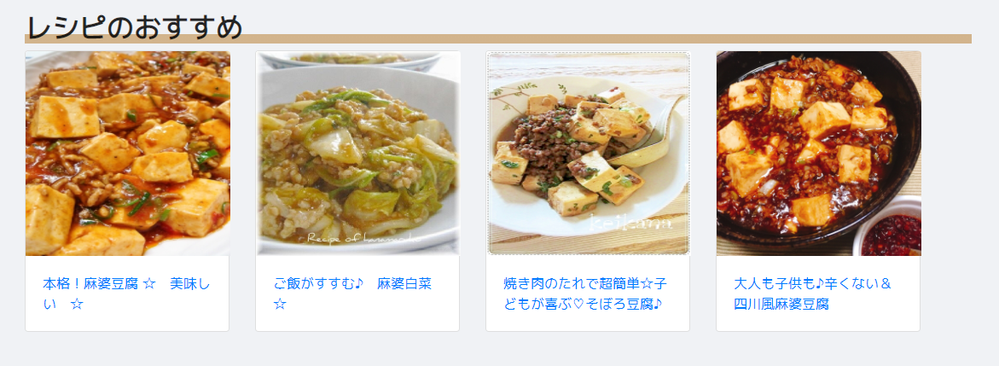

# 献立アプリ「らくっく」

アクセスは[こちら](https://kondate-app.vercel.app/)

## 使用手順

### 1. ユーザ登録
まずは、ユーザ登録をして、献立アプリを始めよう！

### 2. 献立登録
献立を登録しよう！

### 3. レシピ・お店を検索
決めた献立をもとにレシピを検索しよう！

もしくは…外食を検討しよう！食べたいメニューを献立に登録し、オススメのお店を探そう！
